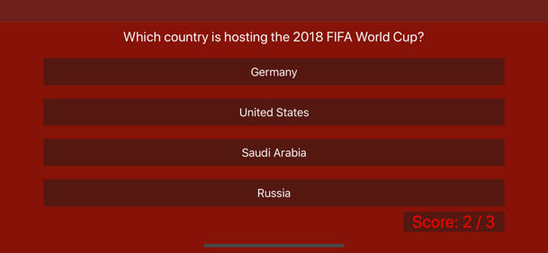

# Trivia

### Find out how much you know about different sports!

This quizz requests data from the opentdb to provide some questions.
The user will answer 10 questions and submit their score to the server. Afterwards, the scoreboard presents the top 3 players.

Features:

- Animated buttons
- Score indicator turns green or red after an answers is tapped
- Score indicator presents the total score
- Impossible to fill in an empty name
- Works fine in portrait and landscape

### Screenshots in chronological order

  

  

  

